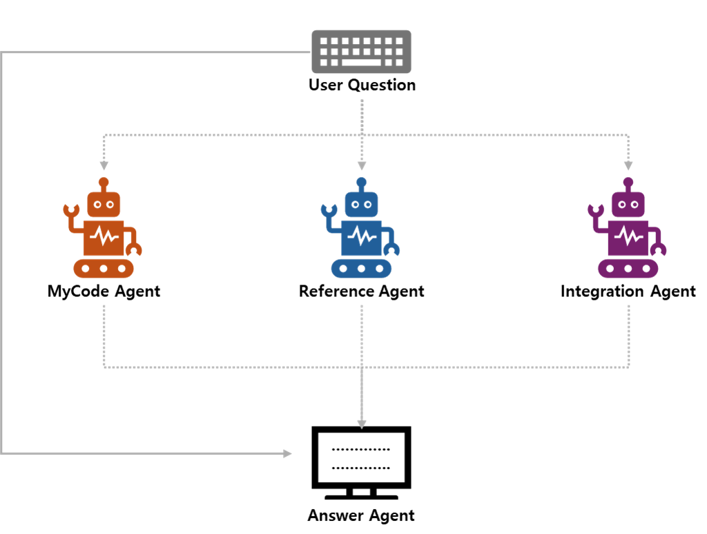

# Code-Analysis Research Assistant (CA-Agent)

논문 메소드 기반 Github 코드와 사용자 코드를 분석하고,  
사용자 질의에 맞춰 **논문 · 레퍼런스 · 내 코드 분석 결과를 RAG 방식으로 종합**하여  
연구 및 구현 관점에서 설명해주는 **Multi-Agent 기반 Code-Analysis Research Assistant**

---

## CA-Agent의 주요 시나리오
- 예시1: (Notion에 있는 논문 중 하나) 논문 코드 설명해줘.
- 예시2: 내 코드 (코드 폴더 경로) 에 대한 코드 분석해줘.
- 예시3: (Notion에 있는 논문 중 하나) 논문과 내 코드 (코드 폴더 경로)에 유사한 부분이 있다면 참고할 수 있는 구조 알려줘.

** 반드시 notino DB에 존재하는 논문이어야하며, 내 코드의 경우 경로가 존재해야됨.**
---

## 전체 아키텍처 개요

---

## LLM 모델
- meta-llama/llama-3.1-8b-instruct

## python 버전
- 3.10
